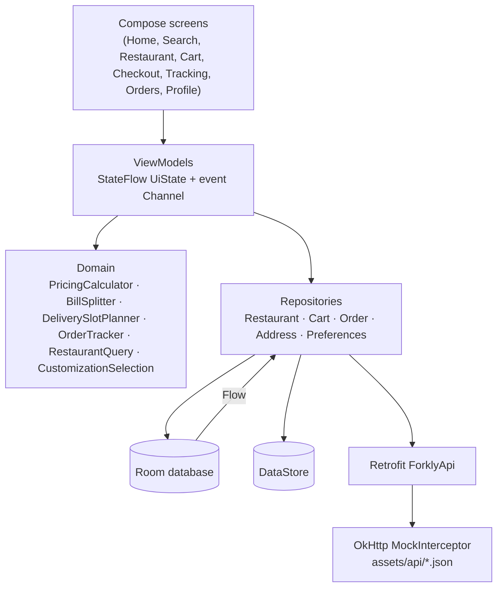
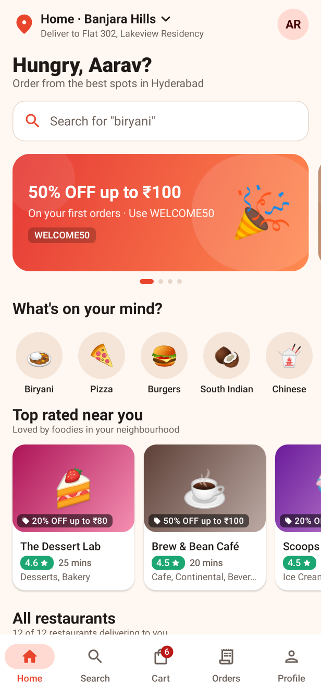
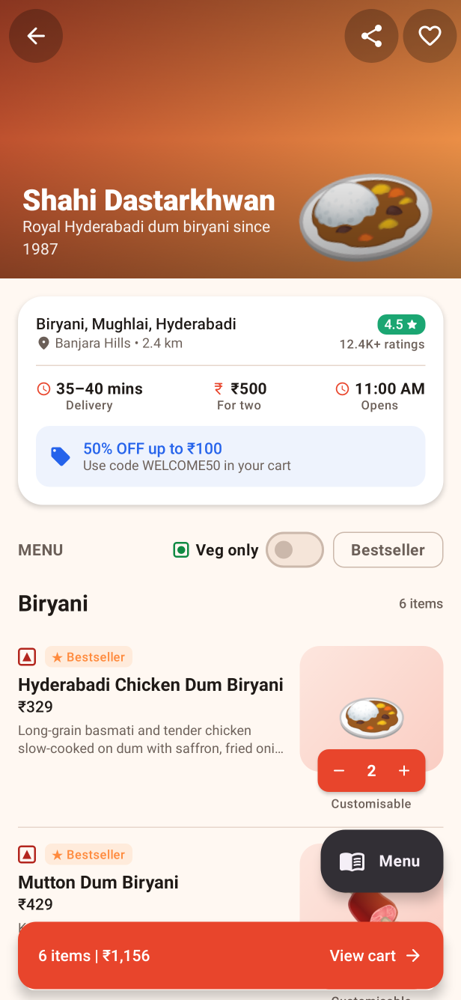
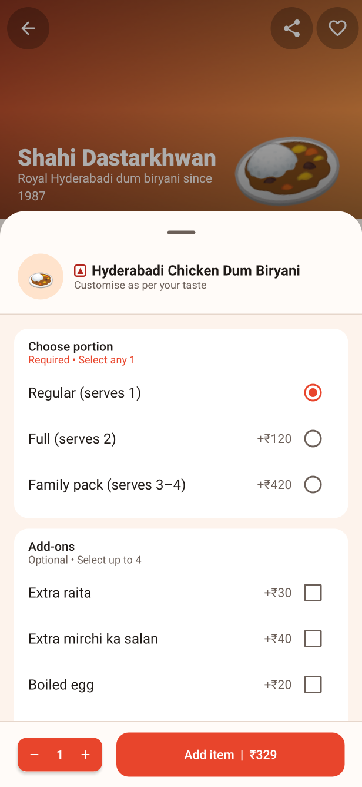
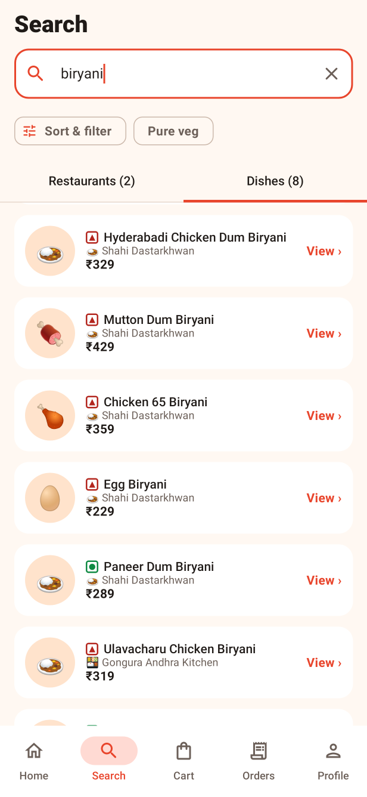
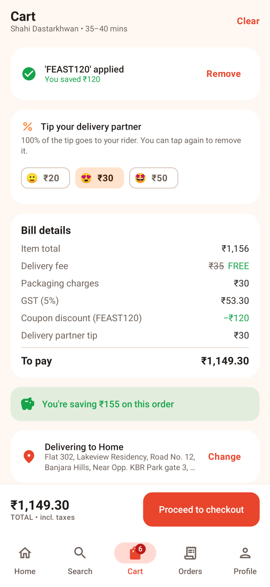
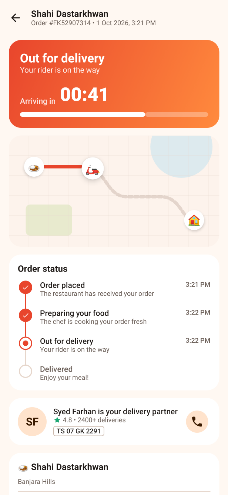
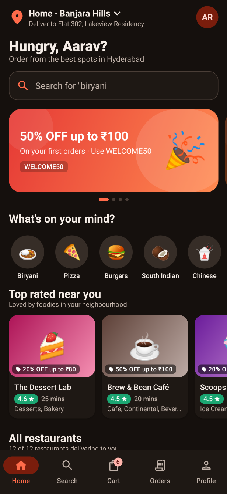
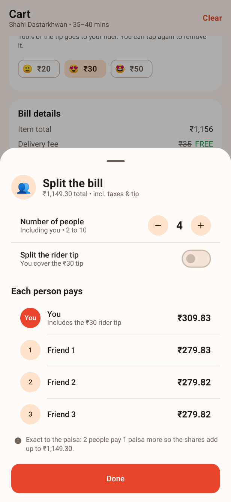
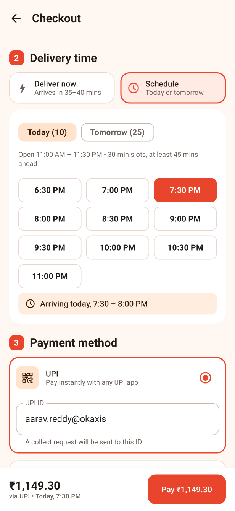

# Forkly

**Order from the best restaurants in Hyderabad — browse menus, customise dishes, apply coupons and track your order live.** A food ordering and delivery app built with Kotlin and Jetpack Compose. It runs fully offline against a mock backend.

[](https://github.com/iEswar23/Forkly/actions/workflows/android-ci.yml)


## Features

- **Home feed**
  - Location header ("Deliver to Home · Banjara Hills") and a search bar whose hint rotates through dish names.
  - Promo carousel built on `HorizontalPager`. It scrolls on its own and pauses while you drag it.
  - Cuisine chips with emoji and a "Top rated near you" rail.
  - All-restaurants feed showing rating, delivery time, cost for two, a pure-veg badge and the current offer.
  - Shimmer skeletons while loading and pull-to-refresh.
- **Search and filters**
  - Debounced search across restaurant names, cuisines, areas and dishes, with separate Restaurants and Dishes tabs.
  - Recent searches, popular dishes and cuisine suggestions.
  - Sort by relevance, rating, delivery time or cost (low→high and high→low).
  - Filters in a bottom sheet: pure veg, rating 4.0+, offers, under 30 mins.
- **Restaurant detail**
  - Collapsing gradient header with an emoji hero that shrinks as you scroll (custom `NestedScrollConnection`).
  - Info card with ratings, ETA, cost for two and the offer.
  - Menu grouped into sections with **sticky headers**, plus veg-only and bestseller toggles and a floating "Menu" jump list.
  - Each dish has a veg/non-veg marker, and its description expands on tap.
  - The **ADD** button morphs into a − qty + stepper.
- **Customisation sheet** for pizzas, burgers, biryanis, coffees, bowls, cakes and more.
  - Required single-choice groups (size or portion) and capped multi-select add-ons.
  - The price updates live as you pick options.
- **Cart** (persisted in Room)
  - Only one restaurant per cart: adding from another restaurant opens a "Replace cart?" dialog.
  - Line steppers, and an Undo snackbar when an item is removed.
  - Progress bar toward free delivery and rider tips.
  - Coupon sheet that shows which coupons you qualify for and how much each saves.
  - **Split bill**: pick 2–10 people and choose whether the rider tip is shared or paid by you, and see each person's share. Shares are exact to the paisa and always add up to the bill.
- **Pricing engine**
  - A pure, unit-tested `PricingCalculator` that works in paise, so there are no floating-point rounding errors.
  - Packaging fee per item (capped), distance-based delivery fee (capped), and a free-delivery threshold.
  - Percentage coupons with discount caps, flat coupons, free-delivery coupons and minimum-order checks.
  - 5% GST, rounded half-up.
  - A pure, unit-tested `BillSplitter` for the split bill: the first *r* people pay one paisa more, so the remainder is spread fairly and nothing is lost to rounding.
- **Checkout**
  - Saved addresses with an add/edit/delete form and validation (pincode, phone).
  - Delivery instructions.
  - **Scheduled delivery**: choose "Deliver now" or schedule a 30-minute slot for later today or tomorrow. Slots stay within the restaurant's opening hours (11:00 AM–11:00 PM when a restaurant has none) and start at least 45 minutes from now. Late-night hours that run past midnight are handled.
  - The chosen slot is saved on the order and shown as "Scheduled for …" on the success screen, in tracking and in order history.
  - Mock UPI (with UPI ID validation), card and cash-on-delivery payments.
  - A simulated payment step, then an animated success screen: a check mark draws itself as confetti bursts.
- **Live order tracking**
  - A Flow-driven timeline: Placed → Preparing → Out for delivery → Delivered.
  - ETA countdown and a stylised route map with the rider moving along it.
  - Rider card with a call action, then rate your order once it's delivered.
  - Status is stored in Room and keeps advancing when you leave the screen. Tracking resumes after the app restarts.
  - A scheduled order waits as "Order scheduled" until its slot begins, then runs the same live timeline.
- **Order history** with reorder. Reorder reprices dishes from today's menu and skips dishes that are no longer available.
- **Favourites** (heart a restaurant from any card) and a **Profile** screen:
  - Editable profile and saved addresses.
  - System / Light / Dark theme.
  - Notification preference toggles (saved locally).
- Edge-to-edge UI, splash screen, adaptive and themed launcher icon, and a consistent light and dark theme with tomato and saffron accents on cream.

> **Demo timing:** live tracking is sped up so the whole delivery takes about 2 minutes. Payments are simulated and no money is charged.

## Tech stack

| Layer | Library |
|---|---|
| Language | Kotlin 2.0, Coroutines, Flow / StateFlow |
| UI | Jetpack Compose, Material 3, Navigation Compose, Compose animations |
| DI | Hilt (`@HiltViewModel`, `@Binds`, `@Provides`, qualifiers) |
| Persistence | Room (restaurants, menus, cart, orders, addresses, favourites, recent searches) with schema migrations, DataStore Preferences |
| Networking | Retrofit 2 + Gson, OkHttp with a `MockInterceptor` serving `assets/api/*.json` with 300–700 ms latency |
| Startup | `core-splashscreen` |
| Testing | JUnit 4, Truth, kotlinx-coroutines-test (virtual time), Robolectric + Roborazzi screenshot tests, Hilt testing |
| CI | GitHub Actions (`assembleDebug` + `testDebugUnitTest`) |

## Architecture

MVVM with a repository layer. Room is the single source of truth. The Retrofit API (backed by the mock interceptor) fills and refreshes the cache. ViewModels expose immutable `StateFlow` UI state plus one-off events through a `Channel`.



Key decisions:

- **Money is a `Long` in paise** from the DTO mappers onward. Display formatting (`₹1,23,456.50`, Indian digit grouping) happens only at the edge.
- **Order tracking depends only on elapsed time.** `OrderTracker.snapshotAt(elapsed)` is a pure function. A ticking `Flow` wraps it for the UI, and an application-scoped job writes status changes to Room. This makes tracking easy to test with virtual time, and it survives process death.
- **Time comes from an injected `Clock`.** `DeliverySlotPlanner` and `OrderTracker` never read the system time directly, so slot rules and tracking are tested with fixed or virtual time. A scheduled order's timeline simply starts at its slot (`Order.trackingStartsAt`) instead of at placement.
- **One `CartViewModel` owns every cart mutation.** The menu, the cart screen and reorder all go through it, so the replace-cart rule, coupon validation and undo are enforced in one place.

## Package structure

```
io.github.ieswar23.forkly
├── ForklyApplication.kt / MainActivity.kt / MainViewModel.kt
├── data
│   ├── local          # Room database, entities, DAOs, type converters
│   ├── remote         # Retrofit API, DTOs, MockInterceptor
│   ├── mapper         # DTO ↔ entity ↔ domain mapping
│   └── repository     # Repository interfaces + implementations, seed data
├── di                 # Hilt modules (app, data, network, repositories)
├── domain
│   ├── model          # Restaurant, MenuItem, Cart, Coupon, Order, Address, …
│   ├── pricing        # PricingCalculator, CouponCatalog, BillSplitter
│   ├── scheduling     # DeliverySlotPlanner, OpeningHours
│   ├── search         # RestaurantQuery (filter/sort rules)
│   └── tracking       # OrderTracker
├── ui
│   ├── home  search  restaurant  cart  checkout  tracking  orders  favorites  profile
│   ├── common         # Cards, steppers, badges, shimmer, sheets, empty states
│   ├── navigation     # Routes, bottom navigation, NavHost
│   └── theme          # Colors, typography, shapes, spacing
└── util               # Formatters, Clock, UiState
```

## Getting started

1. Install **Android Studio Ladybug (2024.2.1) or newer** with **JDK 17**.
2. Clone the repository and open the project folder in Android Studio.
3. Let Gradle sync, then run the `app` configuration on an emulator or device (Android 7.0+).

Or from the command line:

```bash
./gradlew assembleDebug
```

No API keys or backend are needed. Everything is served from the bundled JSON in `app/src/main/assets/api`. The data covers 12 Hyderabad restaurants with 13–18 dishes each.

## Testing

```bash
./gradlew testDebugUnitTest
```

There are 126 JVM tests (including the 9 screenshot flows):

- `PricingCalculatorTest`: delivery fee by distance, packaging cap, free-delivery threshold, percentage, flat and free-delivery coupons, discount caps, minimum orders, GST rounding, tips.
- `CartViewModelTest`: merging lines, customised variants, the replace-cart rule (confirm and dismiss), undo, applying, rejecting and invalidating coupons, coupon ranking, tips, reorder repricing, split-bill people limits and tip handling.
- `BillSplitterTest`: even splits, fair one-paisa remainders, shares always summing to the total, a tip paid by the orderer, and validation (2–10 people, impossible tips).
- `DeliverySlotPlannerTest`: parsing opening hours (including past-midnight closing and a fallback), the 45-minute lead time, 30-minute boundaries, closing time, today/tomorrow, and slot formatting.
- `CheckoutViewModelTest`: deliver now vs schedule, preselecting and keeping a slot, the slot sent with the order, and a slot that expires while checkout is open.
- `TrackingViewModelTest`: a scheduled order waits for its slot, then tracks live.
- `DatabaseMigrationTest`: opens a version 1 database with the current schema, so Room runs the migration and validates every table, and checks that existing orders survive.
- `HomeViewModelTest`: refresh, error and cache states, every filter, every sort, category selection, the top-rated rail, favourites.
- `OrderTrackerTest`: stage boundaries, the ticking flow on virtual time, status changes mid-journey, resuming after process death, scheduled orders waiting for their slot.
- `MockApiContractTest`: runs the real Retrofit, Gson and interceptor stack against the bundled JSON and checks the data is consistent (coupons, categories, seeded orders).
- `CustomizationAndFormattingTest`: option selection rules, rupee formatting, address validation.

### Screenshot tests

`AppScreenshotTest` launches the real `MainActivity` on the JVM with **Robolectric** (native graphics) and a Hilt test graph (in-memory Room, real repositories, Retrofit and the mock interceptor), drives the app like a user (open a restaurant, customise a dish, search, cart, split bill, scheduled checkout, order tracking, dark theme) and captures each screen with **Roborazzi**.

```bash
./gradlew recordRoborazziDebug   # re-generate docs/screenshots/*.png
./gradlew verifyRoborazziDebug   # fail if the UI no longer matches the committed images
```

A plain `testDebugUnitTest` still runs these flows end to end (so a crashing screen fails CI) but skips image capture.

## Screenshots

<table>
  <tr>
    <td align="center"><br/><sub><b>Home</b>: offers, cuisines, top rated</sub></td>
    <td align="center"><br/><sub><b>Restaurant</b>: collapsing header, menu, cart bar</sub></td>
    <td align="center"><br/><sub><b>Customise</b>: portions and add-ons</sub></td>
  </tr>
  <tr>
    <td align="center"><br/><sub><b>Search</b>: restaurants and dishes</sub></td>
    <td align="center"><br/><sub><b>Cart</b>: coupon, tip, bill details</sub></td>
    <td align="center"><br/><sub><b>Tracking</b>: live ETA, rider, timeline</sub></td>
  </tr>
  <tr>
    <td align="center"><br/><sub><b>Dark theme</b></sub></td>
    <td align="center"><br/><sub><b>Split bill</b>: each person's exact share</sub></td>
    <td align="center"><br/><sub><b>Schedule</b>: 30-minute delivery slots</sub></td>
  </tr>
</table>

<sub>Rendered from the real app (Hilt graph, Room, Retrofit + mock interceptor) by the Robolectric/Roborazzi screenshot tests.</sub>

## Roadmap

- Move order-status progression to **WorkManager** with real notifications (`POST_NOTIFICATIONS`), so updates arrive even when the app is closed.
- Swap the mock interceptor for a real backend, and add **Paging 3** to the restaurant feed.
- Add instrumented **Compose UI tests** on devices for the full checkout flow (add to cart → pay → tracking).
- Add map-based address picking and live rider location using a maps SDK.

## License

Released under the [MIT License](LICENSE).

## Author

**Eswar Reddy Madhira** — Android Developer

[](https://www.linkedin.com/in/eswar-reddy-android)
[](https://github.com/iEswar23)
